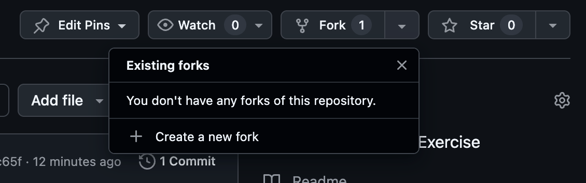

## Setup Instructions
1. **Fork this repository** to your own GitHub account
 

2. **Clone your fork** to your local machine
   ```bash
   git clone https://github.com/YOUR_USERNAME/React-Coding-Exercise.git
   cd React-Coding-Exercise
   ```

3. **Install dependencies**
   ```bash
   npm install
   ```

4. **Start the development server**
   ```bash
   npm start
   ```

5. **Complete the exercise**, commit your changes, and push to your forked repository
   ```bash
   git add .
   git commit -m "Complete countdown timer exercise"
   git push origin main
   ```

## React Countdown Timer Exercise

 

> [!NOTE]
> The goal of this exercise is not to see if you can solve every problem but instead to see how you work through problems.
> 
> Ask as many clarifying questions as you need, and think out loud to help us understand your process.

**For this exercise, we would like you to build a simple countdown timer. You will need:**
* A **"Start"** button
* A **"Pause"** button
* A **"Reset"** button
* An element to display the counter

### Requirements

- The timer should start at **30 seconds**
- The counter's display should be in seconds - whole numbers only
- Clicking **"Start"** should begin the countdown
  - If paused, the timer should resume counting down from the paused value
- Clicking **"Pause"** should pause the countdown
  - The value should not be reset
- Clicking the **"Reset"** should set the timer back to its initial value (**30 seconds**)
  - If the timer is running, reset and continue counting down
  - If the timer is paused, reset and keep paused
- When the countdown timer reaches 0, it should stop and log `"Timer Complete"` to the console
    

